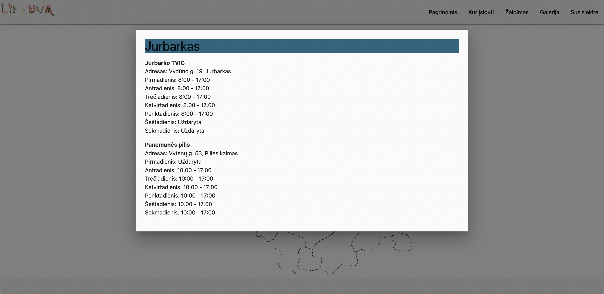

## Surink Lietuvą

Website for "Surink Lietuvą" magnet collection project 
 
More about the project: 
https://welovelithuania.com/surink-lietuva/

Home page
 

Map page. Hover mouse pointer on region to reveal  

  

Click on a region to get a list of places where you can buy magnet of that region 

Gallery 

